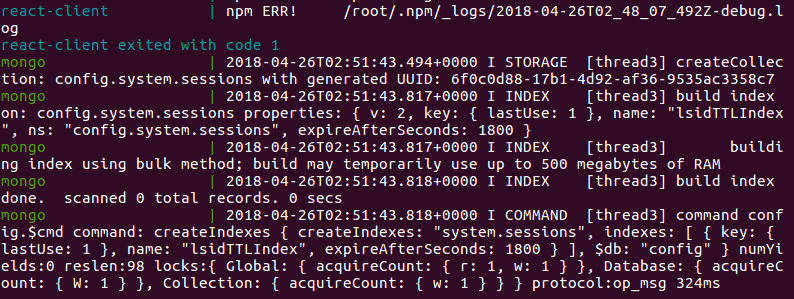

#  Docker Golang GRPC Protobuf MongoDB NPM React CoreUI Webpack

This is a demo project for my portfolio.
This project was derived from https://github.com/robscodebase/technicianrouteplanner
The original project used Vue for the front end client.
If you are interested in hiring me for work please email me at robscodebase@gmail.com.

Unless otherwise noted, these source files are distributed under the
BSD-style license found in the LICENSE file.

### Clone Repo

You must have Docker and Docker-Compose installed on your machine.
* Clone repo.
  * `git clone https://github.com/robscodebase/react-techrouteplanner.git`

### Run Docker-Compose
* Build can take several minutes and you may have to run build twice if you don't have the node modules in the shared directory.
* Check the screenshot below to see what the finished build looks like in terminal.

 
* Navigate to /react-techrouteplanner
  * `sudo docker-compose up`

### View App

* Open browser and navigate to http://localhost:8080/#/dashboard

### Included Languages.
* Golang
* GRPC
* Protobuf
* Nodejs
* Javascript
* NPM
* Webpack
* Mapbox
* React
* Docker
* MongoDB
* CoreUI

